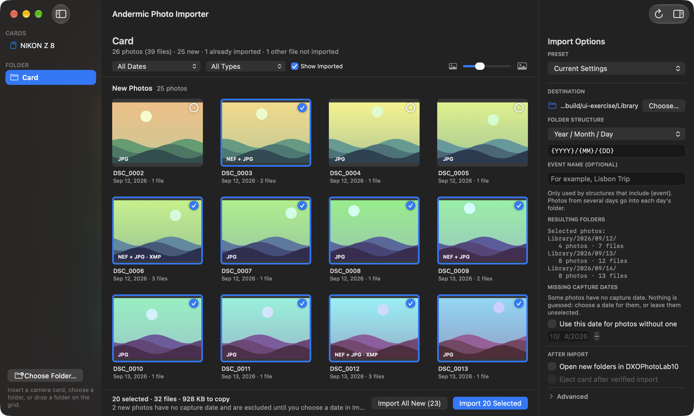

# Andermic Photo Importer

A lightweight native macOS app that copies **only new photo and video originals** from a camera card or folder into ordinary folders. No account, cloud service, telemetry, or photo library database. Photo development stays in DxO PhotoLab or your preferred editor.




**Development preview:** builds are ad hoc signed and not notarized. Real-camera, clean-machine, and older-macOS qualification remain in progress. See [the specification](docs/SPEC.md) and [roadmap](docs/ROADMAP.md).

## Use it

1. Open the app. Nothing else needs to be installed: metadata reading is built in.
2. Insert a camera card. By default, the app shows its window and scans the card. You can also choose a folder (⌘O), drop one on the grid, or open one with the app. Scanning only previews; nothing is copied until you click an import button.
3. Review the thumbnail grid. New photos are selected. Click a photo to include or exclude it, and Shift-click to toggle a range. Filter by date or file type, or hide photos already imported.
4. Check **Import Options**. The destination defaults to your Pictures folder, and the folder structure defaults to Year / Month / Day (`~/Pictures/2026/10/04/`). Choices are remembered and can be saved as presets. An event name is optional.
5. Click **Import N Selected** or **Import All New**. Optionally, open the new folders in your editor and eject the card after verification.

The app stays in the menu bar when its window closes. Under **Advanced**, you can choose to only show that a card is available instead of opening the window and scanning. Cameras that appear only in Image Capture must first be copied into a normal folder.

## Folder structures

| Structure | Template | Example |
| --- | --- | --- |
| Year / Month / Day (default) | `{YYYY}/{MM}/{DD}` | `2026/10/04/` |
| Year / Year-Month-Day | `{YYYY}/{YYYY}-{MM}-{DD}` | `2026/2026-10-04/` |
| Year / Month-Day - Event | `{YYYY}/{MM}-{DD} - {event}` | `2026/10-04 - Lisbon Trip/` |
| Year / Event | `{YYYY}/{event}` | `2026/Lisbon Trip/` |
| Event | `{event}` | `Lisbon Trip/` |

Tokens: `{YYYY}`, `{YY}`, `{MM}`, `{DD}`, `{event}`. `/` separates folder levels. Each photo goes into the folder for its own camera-recorded capture day, so a card spanning several days needs no event name. Photos without a capture date are never guessed. They stay unselected until you choose a date for them in Import Options.

## Related files

RAW+JPEG pairs, Live Photo HEIC+MOV pairs, and sidecars (`.xmp`, `.dop`, `.pp3`, `.aae`, `.thm`, `.wav`) with the same name in the same folder are shown and selected as one photo. Every file is still copied and verified individually. If a filename is already taken by a different file, all of the photo's files get the same suffix, so they stay together. For a photo that is already imported, a missing sidecar is placed beside it. A sidecar that differs from the one beside it (for example, after editing) is imported with a matching copy of the photo under a shared name; the existing sidecar is never replaced. Full rules: [ADR-0005](docs/decisions/0005-photo-groups-selection-and-sources.md).

## Copy safety

- Originals are copied byte-for-byte; files on cards are never modified or deleted.
- A photo counts as already imported only when a file with identical contents exists anywhere under the destination, including renamed files. Size and small samples only find candidates. Import reports are never treated as proof.
- Copies are staged, flushed, read back, verified, published without overwriting, and verified again before the import is complete or the card is ejected.
- Stopping or a failure keeps completed, verified copies, removes the in-progress staging files, and leaves the card mounted. Import again or rescan to continue.
- Symbolic links, hidden files, packages, folder names that escape the destination, and overlapping source/destination folders are refused.

Photo formats include NEF, NRW, CR2/CR3, ARW, RAF, ORF, RW2, DNG, GPR, JPEG, HEIC/HEIF, TIFF, PNG, and others in `MediaTypes`, plus common video formats. **Limitation:** an original whose embedded metadata was edited by another app has a different hash and appears new.

Settings and import reports are local files in `~/Library/Application Support/Andermic Photo Importer/`. Prototype settings from `Photo Import/` are adopted once and left in place.

## Build and test

Apple's Command Line Tools are required to build. The first build downloads pinned, checksum-verified Perl and ExifTool sources and compiles the bundled metadata helper (about 2 minutes). The app targets macOS 13+, but earlier versions are not yet qualified.

```sh
xcode-select --install
./test.sh
./build.sh
./scripts/package.sh
./scripts/verify-package.sh
```

The app appears at `dist/Andermic Photo Importer.app`. Each build targets the current Mac's architecture. `./scripts/ui-exercise.sh` drives the real GUI against synthetic cards and saves screenshots to `build/screens/`. It uses a separate test-only build and isolated settings, and never touches other mounted volumes.

## CI and releases

- Pushes to `main`, pull requests, and manual runs build and test on Apple silicon and Intel runners. CI builds the pinned helper natively for each architecture, then verifies the packaged archives.
- A version tag matching `VERSION` (such as `v0.1.0-alpha.1`) builds both architectures from verified sources and creates a **draft prerelease** with ZIPs and SHA-256 checksums. Drafts are never published automatically.
- [Release instructions](docs/RELEASE.md) cover Developer ID signing, notarization, and qualification.

Product behavior: [specification](docs/SPEC.md). Decisions: [ADR-0001](docs/decisions/0001-local-importer-and-release-foundation.md) to [ADR-0005](docs/decisions/0005-photo-groups-selection-and-sources.md). Evidence: [validation](docs/VALIDATION.md).

## Hosting and license

The product page is [andermic.com/projects/photo-importer](https://andermic.com/projects/photo-importer/). Releases are not notarized (there's no Apple Developer ID yet): build from source with `./build.sh`, or download a release and allow it in System Settings → Privacy & Security → "Open Anyway" on first launch.

The app is released under the [MIT License](LICENSE). Bundled ExifTool and Perl keep their own licenses, shown in the app under **Third-Party Notices** ([ADR-0004](docs/decisions/0004-self-contained-metadata-helper.md)). The icon is the accepted Aperture A concept; builds generate macOS icon sizes from the original PNG.
